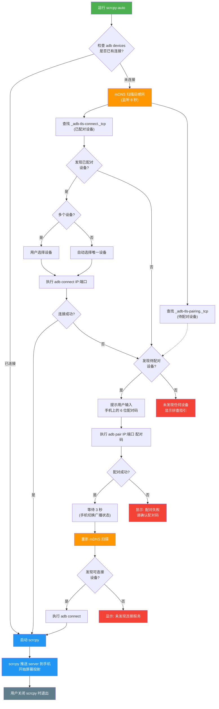
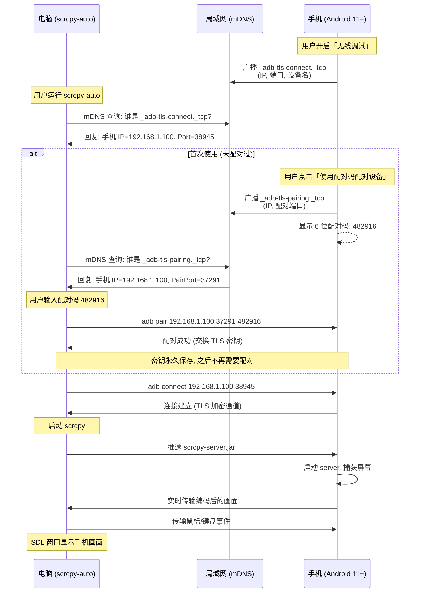

# scrcpy-auto

自动发现、配对、连接 Android 设备并启动 scrcpy 的工具。

## 使用方法

```bash
# 日常使用（一条命令搞定）
scrcpy-auto

# 强制重新发现设备
scrcpy-auto -r

# 传递额外参数给 scrcpy
scrcpy-auto --no-audio
```

## 流程图



## 技术原理图



## 关键概念

### 配对 vs 连接

|              | 配对 (pair)             | 连接 (connect)              |
| ------------ | ----------------------- | --------------------------- |
| 做什么       | 交换 TLS 密钥           | 建立通信通道                |
| 类比         | 蓝牙配对                | 蓝牙连接                    |
| 频率         | 只需一次                | 每次使用                    |
| 换网络后     | 不需要重新配对          | 需要重新连接 (工具自动处理) |
| mDNS 服务    | `_adb-tls-pairing._tcp` | `_adb-tls-connect._tcp`     |
| 需要用户操作 | 输入 6 位配对码         | 无 (全自动)                 |

### 为什么换网络不用重新配对?

配对的本质是密钥交换：

- 电脑的密钥保存在 `~/.android/adbkey`
- 手机记住了这个密钥的公钥

换网络后只是 IP 和端口变了，但密钥没变。
工具通过 mDNS 自动发现新的 IP 和端口，所以换网络也能自动连上。
